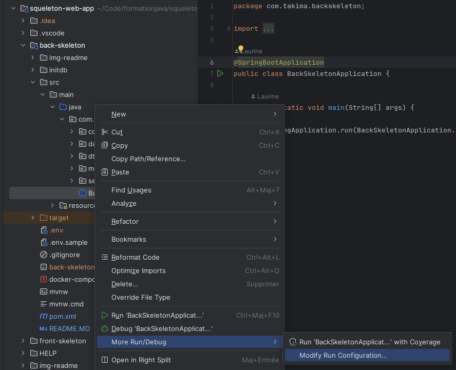
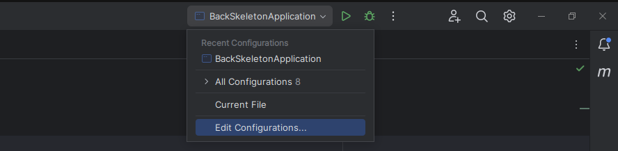
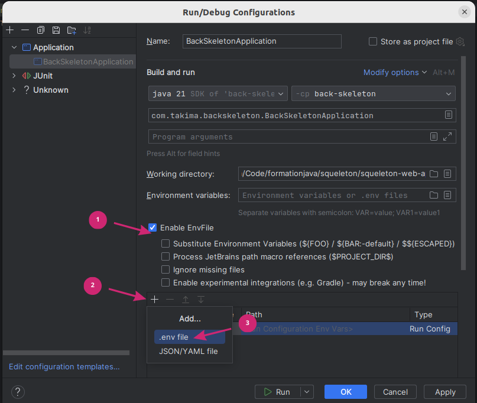
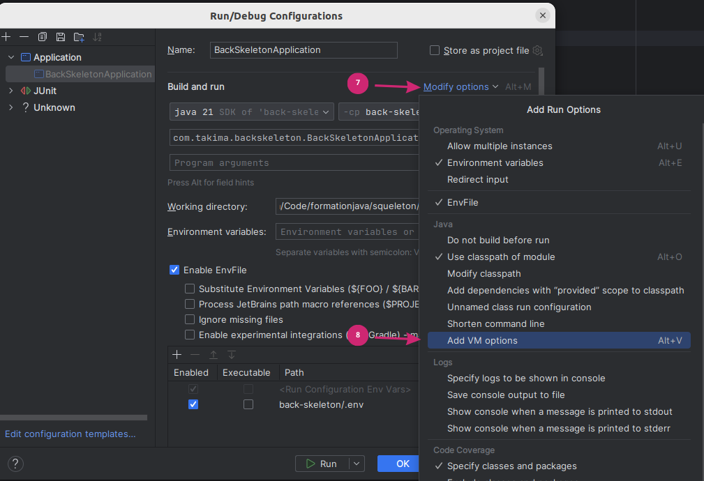
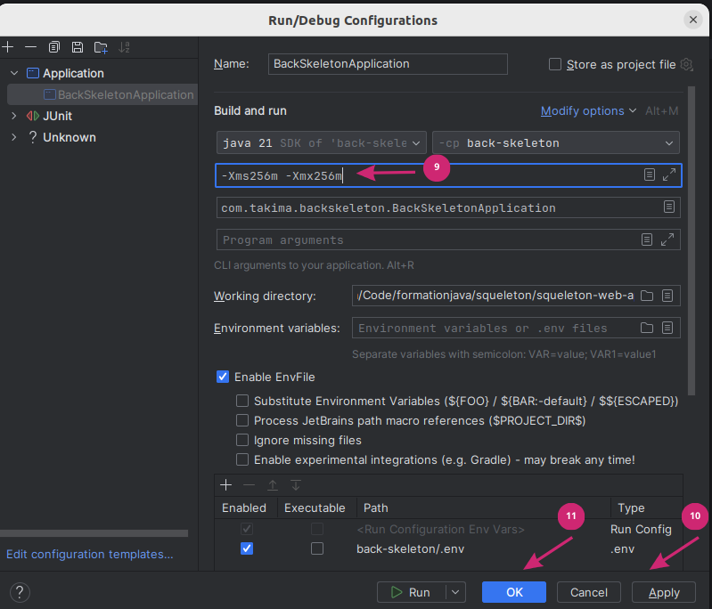
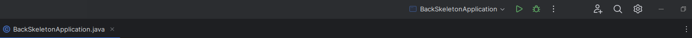
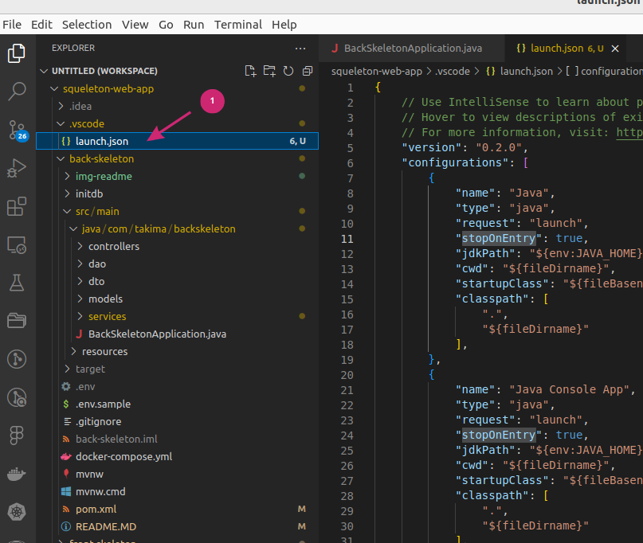
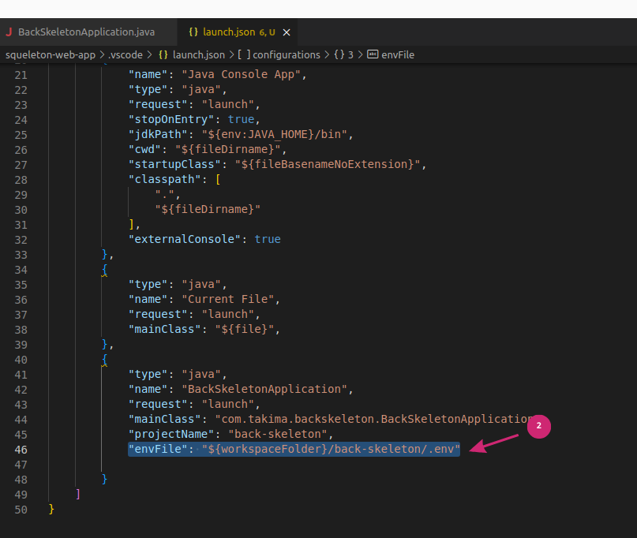
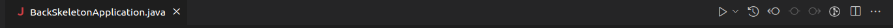
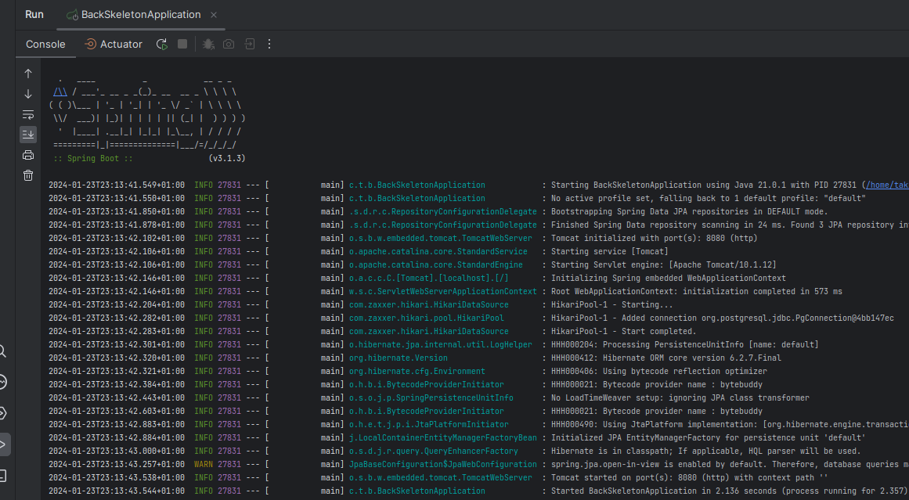

# Votre backend 

## I. Créer et lancer la base de données 
1. Copiez-collez le .env.sample en .env et définissez les variables.
2. Faites un `docker compose up`

## II. Lancer l'API 

<details>
  <summary>Avec IntelliJ</summary>

1. Rajoutez le pluggin : https://plugins.jetbrains.com/plugin/7861-envfile
2. Configurez les variables d'environnement :

    **Deux** façons de faire :
    Clic droit pour le menu et choisir : 
    <p align="center">
    
    </p>
    
    **OU**
    <p align="center">
    
    </p>

   Dans la fenêtre qui s'ouvre, faites ce qui suit :
   
   (1) 
   <p align="center"></p>
   
   (2) 
   <p align="center"></p>

3. Ajoutez l'option `-Xms256m -Xmx256m` (c'est pour éviter que Intellij mange toute ta RAM)

   <p align="center"></p>

   <p align="center"></p>


4. Enfin, lancez le projet :

   <p align="center"></p>

</details>

<details>
  <summary>Avec VS Code</summary>
1. Ajoutez cette ligne au fichier launch.json

```"envFile": "${workspaceFolder}/back-skeleton/.env"``` 
<p align="center">


</p>

Enfin :
<p align="center"></p>

</details>

#### Alors ça marche ?
<p align="center"></p>
